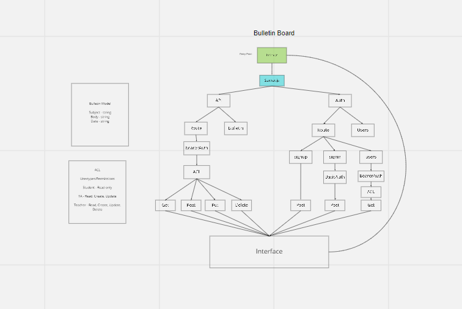

# Cli_notedpad

Created by Anthony Morton, Dario Vitorte, Harvey Lucas

## Installation

Express, jest, dotenv, supertest, nodemon, pg, sequelize, sequelize-cli, sqlite3, base-64, bcrypt, cors, jsonwebtoken, morgan, method-override, eslint

## Summary of Problem Domain

An application to CRUD bulletin board items

API/Auth server must be deployed
Use of your API server to perform database operations
Use of login/auth/acl to control access to your resources

## Links to application deployment

signin: https://cli-notepad.herokuapp.com/signin
signup: https://cli-notepad.herokuapp.com/signup
bulletin: https://cli-notepad.herokuapp.com/api/bulletin
pull: https://github.com/table-9/cli-notepad/pull/11
actions: https://github.com/table-9/cli-notepad/actions

## Include embedded UML

## Talk about your routes

## Routes

- HTTP POST

  - Path: /Signin

    - validates user using basic auth

    - HTTP POST

  - Path: /Signup

    - Creates new username/password in db

      - HTTP GET

  - Path: /users

    - Gets all users in db using BearerAuth middleware

      - HTTP GET

  - Path: /secret

    - SECRET AREA

      - HTTP GET

  - Path: /model

    - Get bulletin board entries/info

            * HTTP POST

  - Path: /model

    - Create bulletin board entries/info

                * HTTP PUT/PATCH

  - Path: /model

    - update bulletin board entries/info

                    * HTTP DELETE

  - Path: /model
    - delete bulletin board entries/info
